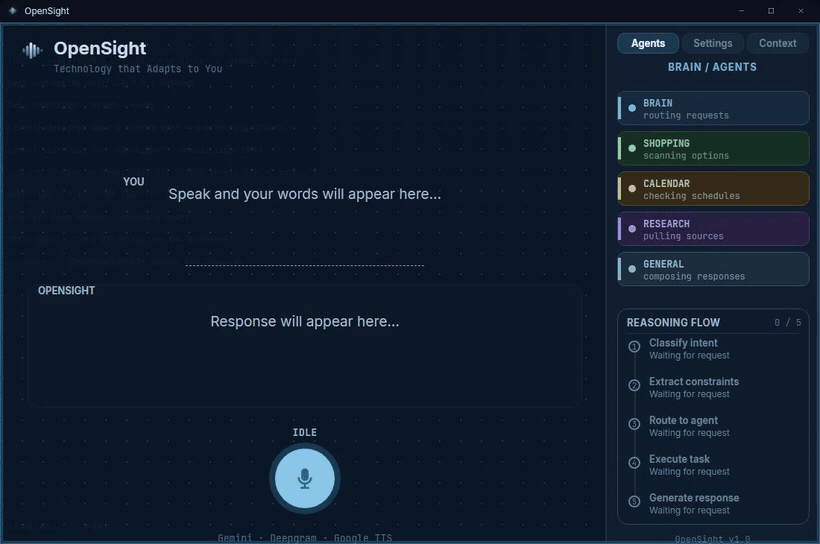
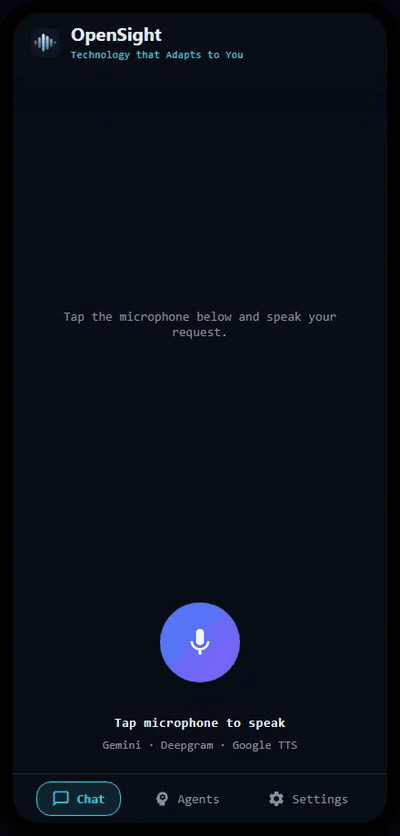
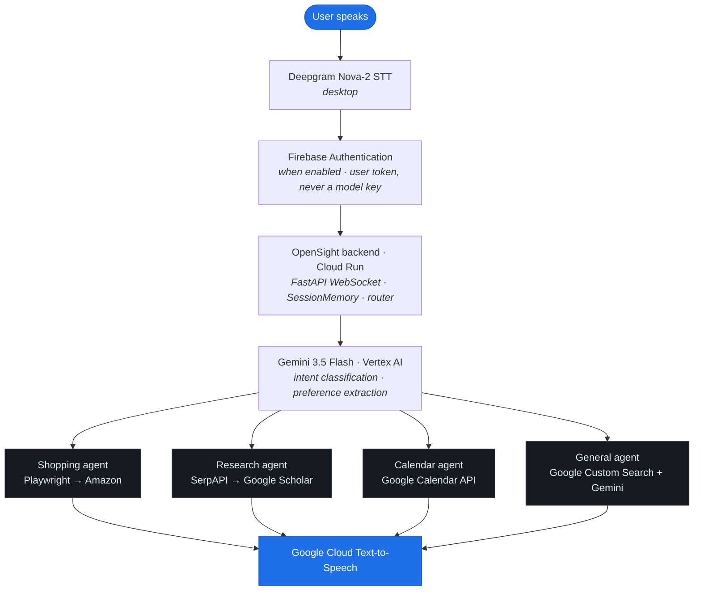

# OpenSight

**Technology that Adapts to You.**

> An AI-powered voice assistant that replaces screen readers with active, intent-driven task execution: navigating, searching, and acting on behalf of blind and low-vision users.

*Google Developer Groups on Campus Solution Challenge 2026 · Sustainable Development Goal 10 · Sustainable Development Goal 3*

---

## Demo

> **[▶ Watch the 2-minute demo](https://youtu.be/UOYZ2oXvdvM)** where OpenSight opens a browser and completes the task live.

Three spoken sentences take the user from a research question to a chosen product. The video shows the assistant opening a browser and driving the live web end to end, advancing its reasoning in real time as it goes. Cross-agent memory carries context across tasks, with zero manual navigation. The full step-by-step demo script lives in [DEMO.md](DEMO.md).

---

## What's built, what's a proof of concept, and what's next

**Built and live:**
- Multi-agent backend deployed on Cloud Run, handling research, shopping, calendar, and general web queries
- Desktop client with wake word, voice input via Deepgram, browser automation via Playwright, and spoken output via Google Cloud Text-to-Speech
- Cross-agent memory: context flows from one agent to the next without the user repeating themselves
- Gemini 3.5 Flash on Vertex AI for intent routing and response synthesis

**Proof of concept:**
- Android client: voice in, voice out, connects to the same backend, with on-device speech and text-to-speech
- Windows `.exe` packaging: shows that single-download distribution for a non-technical user is feasible
- macOS: core functionality tested, full support requires further work on platform-specific features

**On the roadmap:**
- Describing irreducibly-visual content: figures, charts, and flowcharts with no accessible workaround
- Per-user memory that persists across sessions
- Firebase Authentication enforcement across all clients
- Full macOS and Android releases
- OS-level control: file management, email, IDE navigation

---

## Repository structure

This is a monorepo with two clients on one backend:

- **Repo root:** the desktop engine and backend, including the FastAPI WebSocket server (`server.py`), the multi-agent system (`agents/`), the Tkinter desktop UI (`ui/`, `desktop_app.py`), audio/voice (`audio_engine.py`), and browser automation (`desktop_browser.py`). This is the primary OpenSight application.
- **`mobile/`:** the Flutter Android voice client, a thin "voice in, text over `/ws`, voice out" front end that talks to the same backend. It contains no agent or model code; the engine does all the work. The `/ws` message contract both clients implement lives in [CONTRACT.md](CONTRACT.md).

---

## The Problem

**2.2 billion people** worldwide have a vision impairment (WHO, 2023), of whom 39 million are blind. Screen readers were built to describe a page, not to act on it, and that single design choice is why so many users still do far more work than a sighted user to get anything done online.

The web is more accessible than it was a decade ago, and a skilled screen reader user can move quickly through a well-tagged site. But the gains are uneven, and they skip the people who need them most: those with low vision, those who lost their sight recently, and older users, who rarely get the weeks it takes to master a screen reader at speed. For them, and on the sources that defeat even experts, every task is still a linear slog through an entire interface read aloud top to bottom.

- Blind web users lose an average of **30.4% of their time** to frustrating screen reader situations including confusing layout feedback, conflicts with applications, and missing alt text *(Lazar et al., International Journal of Human-Computer Interaction)*
- **97% of sites still carry accessibility failures** *(AudioEye, 2024, scan of ~40,000 enterprise websites)*, and those failures concentrate on exactly the hardest sources: long untagged PDFs, dense academic and journal sites, and badly-structured pages
- Blind users attempting Fortune 500 job applications succeeded only **55.6% of the time**. The shortest application took 20 minutes, the longest took **135 minutes** *(Journal of Visual Impairment & Blindness, 2023)*

A screen reader can tell a user what is on a page, but it cannot search, filter, decide, or carry out the task. OpenSight replaces description with execution.

---

## The Results

OpenSight reduces a multi-step product research and selection task from minutes of screen reader navigation to **under 60 seconds**, and the gain is largest exactly where the barrier is largest.

The clearest number is the one we measured directly. With no prior NVDA experience, completing an omega-3 supplement search task on Amazon took approximately **10 minutes**. The identical task took **under 60 seconds** with OpenSight, an **80-90% reduction in interaction time**. Against the average screen reader user documented in the literature *(Lazar et al.)*, that is roughly a **5x** improvement.

| User type | Screen reader baseline | OpenSight | Speedup |
|---|---|---|---|
| Beginner *(self-measured, first NVDA use)* | ~10 min | ~60 sec | **~10x** |
| Average *(Lazar et al., published literature)* | ~5 min | ~60 sec | **~5x** |

The gain concentrates where the friction does, on the users still climbing the screen reader learning curve and the sources that punish them, not on an expert breezing through a well-tagged page. The improvement is not speed of speech; it is the elimination of navigation overhead.

---

## The Solution

OpenSight replaces passive reading with **active task execution**.

Users speak naturally. OpenSight understands intent, navigates autonomously, and speaks results back without the user ever touching a keyboard or memorizing a shortcut.

**Stanford University** found speech input is **3x faster than keyboard** (161 vs 53 WPM) with a 20.4% lower error rate. OpenSight is built on that insight end to end.

### What makes it different

There are two relevant categories of existing tools, and OpenSight is distinct from each on a different axis.

**Versus screen readers (NVDA, JAWS, VoiceOver):** these read interfaces linearly, carry no context between tasks, and require the user to drive every step. They describe a page. They do not search, filter, compare, or act. OpenSight executes the task and speaks back only the result.

**Versus agentic browsers and assistants (for example ChatGPT Atlas):** these can perform multi-step browser actions and carry context across tasks, so "agentic" alone is not the distinction. The difference is who they are built for. Agent mode in tools like Atlas is designed to be supervised visually: it narrates what it is doing, pauses for the user to watch on sensitive steps, and assumes the user can see the screen and take over. That interaction model presumes sight. ChatGPT Atlas, one of the most advanced agentic browsers available, was rated 1 out of 10 for screen reader accessibility by Taylor Arndt, a blind accessibility expert and Chief Accessibility Officer at Techopolis (Double Tap, October 2025). OpenSight is built to be operated entirely without sight: voice in, a spoken answer out, a wake word instead of a cursor, and no visual surface to monitor.

OpenSight does all of this with a single spoken sentence per step.

**Cross-agent memory:** After a research query, OpenSight automatically carries that context into a follow-up shopping search. The user says *"find me a supplement for that"* and OpenSight already knows what "that" is. No existing screen reader or voice assistant does this for a non-sighted user end to end.

**Live page awareness:** When a product page opens, OpenSight scrapes it in real time. Asking *"what are the ingredients"* returns the actual ingredient list from the open page, not a generic web search.

**Wake word activation:** Say *"OpenSight"* from anywhere and the app comes to the foreground, ready to listen. Browser windows step aside automatically. OpenSight reclaims focus when you speak to it.

---

## Interface

*The desktop client (engine + Tkinter UI) during a research query.*

*The Flutter Android voice client (`mobile/`): a thin "voice in, text over `/ws`, voice out" front end on the same backend.*

---

## Architecture

*The diagram shows the desktop pipeline; the backend runs as a containerized service on Cloud Run. The Android client performs speech-to-text and text-to-speech on-device, and everything from the WebSocket inward is identical.*

### How it works

**No client holds the model key:** Clients talk only to the backend, which holds the Vertex AI credentials and makes every Gemini call itself. Server-side Firebase ID-token verification is implemented and the client authentication path is built, so access can be gated by per-user identity rather than a shared key. Enforcement sits behind a feature flag that is off for the demo, with full enforcement and a desktop handshake on the near-term roadmap.

**Deployment:** The backend is containerized and deployed live on Cloud Run, and both clients default to it, connecting over the internet. Localhost is available as a local-development override.

**Production model serving:** Gemini 3.5 Flash runs on Vertex AI, Google's production AI platform, giving production-grade quota and scaling rather than a rate-limited developer key. The credential is loaded server-side via Application Default Credentials.

**Routing:** Every utterance passes through Gemini 3.5 Flash, which classifies intent and decides which agent handles it. Follow-up queries are detected and short-circuited before Gemini using local pattern matching, preserving context without an extra model call.

**Cross-agent handoff:** `SessionMemory` is shared across all agents in the backend. When the Research agent finds papers on a topic, it extracts a product hint and stores it. When the user says *"find me a supplement for that under $30"*, the router detects the research context and builds the Amazon query automatically. The product hint is produced by a Gemini call rather than a hardcoded keyword table, so the handoff generalizes to topics it was never explicitly coded for, not just the ones in the demo. Memory is currently shared per backend instance; per-user identity and persistent per-user memory across sessions are on the roadmap.

**Browser lifecycle:** On the desktop client, all browser windows are managed through a central `browser_manager` registry. Opening Amazon closes Scholar. Opening a product page closes Amazon. When the wake word fires, `browser_manager.focus_opensight()` snaps the desktop app back to the foreground via Win32 `SetForegroundWindow`.

**Live scraping:** When a product page opens, Playwright waits for the result content to load, then scrapes ingredient fields and feature bullets before handing control to the user. Follow-up questions about the open product are answered from the scraped data, not a web search, so the spoken answer matches what is on the page.

---

## Validation

OpenSight is validated on two tracks: structured task testing, and direct engagement with the blind users and organizations who live and work with this problem every day.

### Task testing

Tested using simulated visual impairment methodology, a standard technique in HCI accessibility research where participants complete tasks without visual input to approximate the screen reader experience. This is an honest limitation: it approximates the screen reader experience but does not replace lived expertise, which is why the second track matters more, and why structured trials with BVI participants are the planned next phase.

**Self-measured baseline:** With no prior NVDA experience, the omega-3 supplement search task on Amazon took approximately 10 minutes. The identical task took under 60 seconds with OpenSight.

**Structured user testing (20 participants):**

- Average speed improvement rating: **7.9 / 10**
- Average navigation replacement rating: **7.8 / 10**
- Task completion rate: **20 / 20 participants completed the full four-step demo task without assistance**
- 80% said they would use a voice-first interface daily or for specific tasks

Three feedback themes emerged. Response latency on complex queries (raised by 3 participants) is addressed: a local fast path now answers common follow-ups without calling the routing model at all, removing that delay. Spoken responses that ran too long (raised by participants) were tightened to short, direct answers, which cut the time to a usable result on every query. Accent recognition on non-standard accents (raised by 4 participants) is a current priority in the speech layer, and clearer turn-taking cues are provided by the wake word, which gives an explicit spoken cue.

### Expert and stakeholder validation

We are engaging directly with blind users, leaders, and organizations in the BVI space to validate the problem and shape the product around real needs.

**Blind Institute of Technology (BIT):** We met with Andrew Johnson, a totally blind Salesforce developer and technologist at BIT, for a direct validation session. As a blind-from-birth power user, he helped us sharpen who benefits most: low-vision users, those who lost their sight recently, and older users, rather than expert screen reader users who already move quickly, and he flagged that macOS VoiceOver lags far behind Windows screen readers. He also pointed us to the content with no accessible workaround at all, the figures, charts, and flowcharts (tools like Lucidchart and Mermaid) that are invisible to every screen reader, which is now the top item on our build roadmap. BIT, which places blind and visually impaired professionals at Fortune 500 companies, is now an advisory organization for the project.

**Virginia Department for the Blind and Vision Impaired (DBVI):** We met with the Regional Manager, who helped validate the problem and refine the product, and whose feedback directly informed planned low-vision support such as font scaling. A session with the Director of Rehabilitation Technology Services is scheduled next.

Structured trials with blind and visually impaired participants are the next validation phase, moving beyond simulated testing to direct feedback from the community OpenSight is built for.

**Clean install verified:** The full setup from a fresh build has been tested and confirmed working.

---

## Scalability & Future Vision

### Built to scale

OpenSight is built around decisions that make it inherently extensible and ready for real users.

**Multi-agent architecture:** Adding a new capability (email, file management, IDE control, music) is just adding a new agent file and a routing rule in `router.py`. The voice pipeline, memory system, and WebSocket server are fully decoupled from what agents do. The system currently has four agents. It could have fifty without touching the core, and an open plugin architecture would let third-party developers contribute agents for the tools their own communities need.

**Thin clients, backend on Cloud Run:** No client holds the model key; the backend makes every Gemini call and keeps credentials server-side. The backend is containerized and deployed live on Cloud Run, and both clients connect to it over the internet, with localhost available for local development. The Android client is a genuinely thin client that does its voice input and output on-device and carries no model credentials. The desktop client adds local voice I/O and drives the browser window on the user's machine.

**Distribution built for a non-technical user:** The target user is a blind or visually impaired person, not a developer, so the client has to behave like an ordinary consumer app. The desktop client was packaged as a standalone Windows executable as a proof of concept, to show that a single download with nothing to configure is feasible. The agents, model access, and orchestration live in the Cloud Run backend, so the client stays thin and onboarding a new user is a download plus a connection to the deployed backend, not a setup process.

**Cross-platform reach (proof of concept):** A Flutter-based **Android client** has been built as a completed proof of concept. It is a thin, accessible, voice-first front end to the same backend, with on-device speech-to-text and text-to-speech, designed to be fully usable eyes-free with Android TalkBack. It was built phone-first on purpose: blind and visually impaired users rely overwhelmingly on phones with built-in screen readers, so the phone is the real distribution surface. iOS was intentionally excluded from this phase. That platform's permission model places inherent constraints on the always-listening microphone access and cross-application control that are central to OpenSight's design, whereas Android's more open model fits a voice-first, always-available assistant.

The always-on wake word loop means OpenSight already functions as a background accessibility layer, the foundation for full OS-level control across any application.

### Near-term roadmap

- Describing irreducibly-visual content: figures and charts in papers, and flowcharts in tools like Lucidchart and Mermaid, which have no accessible workaround at all. This is the top priority, identified directly through our BIT advisory session
- Extend support to macOS, where screen readers lag far behind Windows and the assistant has the most to add
- Full OS-level control: IDE navigation, file management, email
- Per-user identity and persistent per-user memory on the deployed Cloud Run backend, so each user's context is isolated and survives across sessions
- Low-vision support: font scaling and screen magnification alongside the voice-first flow
- Extend Firebase Authentication to the desktop client and enable enforcement by default, with Firebase App Check for hardening
- Harden the Android proof of concept into a full release on the same agent backend
- Braille display output: a parallel text channel alongside voice
- Expanded structured trials with BVI participants through the DBVI and BIT relationships

---

## Google Developer Groups on Campus: Google Technologies Used

| Technology | How OpenSight uses it |
|---|---|
| **Gemini 3.5 Flash** | Intent routing on every utterance, response synthesis, preference extraction, cross-agent reasoning, follow-up detection |
| **Vertex AI** | Production serving for Gemini 3.5 Flash, called server-side via Application Default Credentials: production-grade quota, autoscaling, and control |
| **Cloud Run** | Hosts the containerized backend, deployed live, that both clients connect to over the internet |
| **Firebase Authentication** | Per-user identity. Server-side ID-token verification is implemented and the client authentication path is built; enforcement is behind a feature flag that is off for the demo, with full enforcement on the roadmap |
| **Google Cloud Text-to-Speech** | Spoken responses on the desktop client (the Android client uses on-device text-to-speech) |
| **Google Custom Search API** | Powers the General agent for web search on any query that does not require Amazon, Scholar, or Calendar |
| **Google Calendar API** | The Calendar agent reads and creates events via OAuth |
| **Google Scholar** (via SerpAPI) | Academic paper search for the Research agent, with automatic product keyword extraction for cross-agent handoff |

---

## Sustainable Development Goals Addressed

### SDG 10: Reduced Inequalities *(primary)*

OpenSight directly targets the digital accessibility gap. Blind and low-vision users are systematically excluded from the efficiency gains of modern web interfaces including e-commerce, research tools, and scheduling platforms. By replacing linear screen reading with intent-driven execution, OpenSight reduces the time and cognitive load gap, concentrated where it is largest: the users still climbing the screen reader learning curve and the sources that punish them.

97% of sites still carry accessibility failures, and OpenSight does not wait for the web to fix itself; it navigates it as-is, on behalf of the user.

**Measurable outcome:** A product research and selection task that took about ten minutes on a screen reader with no prior training took under sixty seconds with OpenSight, an 80-90% reduction in interaction time.

### SDG 3: Good Health and Well-Being *(secondary)*

Independence is directly correlated with mental health outcomes for people with disabilities. Tools that reduce reliance on sighted assistance and eliminate the documented frustration of inaccessible interfaces contribute to autonomy, confidence, and well-being. OpenSight requires zero prior technical training and zero memorized keyboard shortcuts.

---

## Tech Stack

| Layer | Technology |
|---|---|
| Voice input | Deepgram Nova-2 real-time STT (desktop); on-device STT (Android) |
| LLM | Gemini 3.5 Flash on Vertex AI (called server-side via Application Default Credentials) |
| Authentication | Firebase Authentication (per-user; server-side verification, enforcement behind a flag) |
| Agent orchestration | Python (custom multi-agent loop) |
| Browser automation | Playwright (Chromium) |
| Voice output | Google Cloud Text-to-Speech (desktop); on-device `flutter_tts` (Android) |
| Backend | FastAPI + WebSockets, containerized and deployed live on Cloud Run; both clients connect to it (localhost available for local dev) |
| Desktop client | Tkinter (custom LiquidGlass renderer), packaged as a standalone Windows `.exe` |
| Mobile client | Android (Flutter), completed proof of concept; iOS excluded by design (platform permission constraints) |
| Memory | In-memory SessionMemory shared across agents, with JSON persistence; per-user isolation on the roadmap |
| Window management | Win32 ctypes (SetForegroundWindow) |

---

## Get OpenSight

- **End users:** the desktop client is packaged as a single Windows executable as a proof of concept; it connects to the deployed Cloud Run backend, so there is nothing to configure. Run it and say **"OpenSight."**
- **Developers:** see **[SETUP.md](SETUP.md)** to install, configure Google Cloud and Firebase, and run from source.
- **Demo:** see **[DEMO.md](DEMO.md)** for the four-step demo script and reset flow.

---

## Team

Built for the **Google Developer Groups on Campus Solution Challenge 2026**

*Virginia Tech*