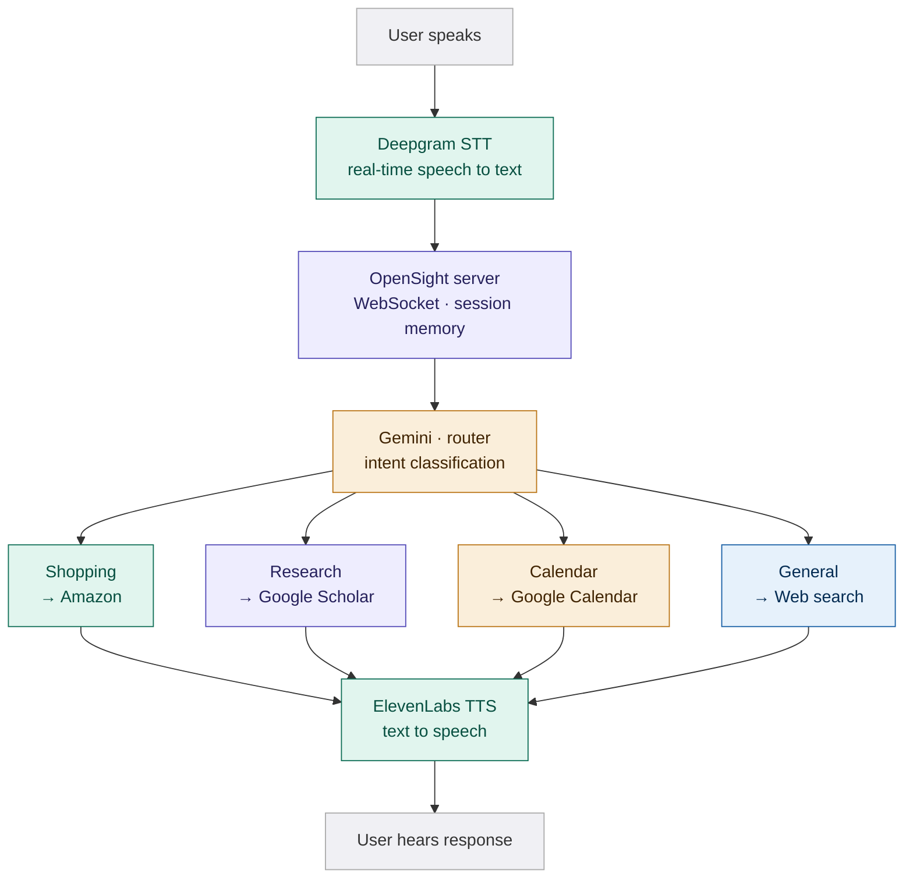

# OpenSight

**Technology that Adapts to You.**

> An AI-powered voice assistant that replaces screen readers with active task execution — navigating, searching, and acting on behalf of visually impaired users.

*GDG on Campus Solution Challenge 2026 · SDG 10 · SDG 3*

---

## Demo

<!-- Replace with your actual demo GIF after recording -->
> **[▶ Watch the 2-minute demo](https://youtube.com/your-link-here)**

Demo flow: *"Find me research on omega-3 and brain health"* → Scholar tab opens → *"Find me a supplement for that under $30"* → Amazon opens automatically → *"Open the first one"* → Product page opens. No repetition. No manual navigation.

---

## The Problem

Screen readers process interfaces **linearly** — reading every element on screen from top to bottom. For a visually impaired user trying to find a product on Amazon:

- They must listen to every navigation element before reaching results
- Complex keyboard shortcuts must be memorized per application
- Poorly structured websites break screen readers entirely
- A task that takes a sighted user **45 seconds** takes a screen reader user **8+ minutes**

This contributes to a measurable productivity and independence gap for the **285 million people** worldwide living with visual impairment.

---

## The Solution

OpenSight replaces passive reading with **active task execution**.

Users speak naturally. OpenSight:
1. Understands intent across a multi-agent system
2. Navigates browsers, searches APIs, and queries databases autonomously
3. Maintains session memory across turns — no repeating yourself
4. Speaks results back conversationally in real time

The key differentiator: **cross-agent memory**. After researching a topic, OpenSight automatically carries that context into a product search — without being told to.

---

## Architecture



### How it works

**Routing** — Every utterance passes through Gemini 2.5 Flash which classifies intent and decides which agent handles it. Follow-up queries are detected and short-circuited before Gemini — preserving context without extra API calls.

**Cross-agent memory** — A shared `SessionMemory` object persists across all agents and WebSocket reconnects. When Research finds papers on omega-3, it extracts a `product_hint` and stores it. When the user then says *"find me a supplement for that"*, the router detects the research context and builds the Amazon query automatically.

**Browser control** — Shopping and Research agents use Playwright to control real Chromium windows. When a product page opens, it is scraped for ingredients and feature bullets — so follow-up questions like *"what are the ingredients"* are answered from the live page, not a web search.

---

## Google Technologies

| Technology | Usage |
|---|---|
| **Gemini 2.5 Flash** | Intent routing, response synthesis, preference extraction, cross-agent reasoning |
| **Google Custom Search API** | Web search for the General agent |
| **Google Calendar API** | Read and create calendar events via the Calendar agent |
| **Google Scholar** (via SerpAPI) | Academic paper search for the Research agent |

---

## SDGs Addressed

### SDG 10 — Reduced Inequalities *(primary)*

OpenSight directly targets the **digital accessibility gap**. Visually impaired users are systematically excluded from the efficiency gains of modern web interfaces — e-commerce, research tools, scheduling apps. By replacing linear screen reading with intent-driven navigation, OpenSight reduces the time and cognitive load gap between sighted and visually impaired users.

**Measurable target:** Reduce task completion time for visually impaired users on Amazon from 8+ minutes to under 60 seconds for common shopping flows.

### SDG 3 — Good Health and Well-Being *(secondary)*

Independence is directly linked to mental health outcomes for people with disabilities. Systems that reduce reliance on sighted assistance — and eliminate the frustration of inaccessible interfaces — contribute to autonomy and well-being. OpenSight is designed to be usable without any prior technical training or memorized keyboard shortcuts.

---

## Tech Stack

| Layer | Technology |
|---|---|
| Voice input | Deepgram real-time STT |
| LLM | Gemini 2.5 Flash |
| Agent orchestration | Python (custom multi-agent loop) |
| Browser automation | Playwright (Chromium) |
| Voice output | ElevenLabs TTS |
| Backend | FastAPI + WebSockets |
| Desktop UI | Tkinter (custom LiquidGlass renderer) |
| Memory | JSON persistence + in-memory `SessionMemory` |

---

## Setup

### Prerequisites

- Python 3.11+
- A microphone

### Installation

```bash
git clone https://github.com/YOUR_USERNAME/opensight
cd opensight
pip install -r requirements.txt
playwright install chromium
```

### Environment variables

Create a `.env` file in the project root:

```env
GEMINI_API_KEY=your_key_here
DEEPGRAM_API_KEY=your_key_here
ELEVENLABS_API_KEY=your_key_here

# Google Calendar (OAuth)
GOOGLE_CLIENT_ID=your_client_id
GOOGLE_CLIENT_SECRET=your_client_secret

# Google Custom Search (General agent)
GOOGLE_SEARCH_API_KEY=your_key_here
GOOGLE_SEARCH_CX=your_cx_here

# SerpAPI (Research agent)
SERPAPI_KEY=your_key_here
```

For Google Calendar OAuth, download `credentials.json` from Google Cloud Console and place it in the project root. The `token.json` will be generated on first run.

---

## Running

Open two terminals:

**Terminal 1 — Backend server**
```bash
uvicorn server:app --host 127.0.0.1 --port 8080
```

**Terminal 2 — Desktop app**
```bash
python desktop_app.py
```

Click the orb or press **Space** to start listening.

---

## Try It

Speak these in sequence to see the full cross-agent demo:

1. *"Find me research on omega-3 and brain health"*
2. *"Can you find me a supplement for that under $30"*
3. *"Open the first one"*
4. *"What are the ingredients"*

Each turn is handled by a different agent. Memory carries forward automatically.

---

## Project Structure

```
opensight/
├── agents/
│   ├── router.py          # Gemini intent classifier
│   ├── shopping.py        # Amazon browser agent
│   ├── research.py        # Google Scholar agent
│   ├── calendar.py        # Google Calendar agent
│   └── general.py         # Web search + Gemini agent
├── server.py              # FastAPI WebSocket server
├── desktop_app.py         # Tkinter UI entry point
├── ui_draw.py             # Canvas rendering
├── ui_context.py          # Context panel
├── ui_animations.py       # Animation loops
├── ui_theme.py            # Color themes
├── memory.py              # SessionMemory + persistence
├── audio_engine.py        # Deepgram + ElevenLabs
├── browser_manager.py     # Cross-agent browser lifecycle
└── app_state.py           # Shared UI state
```

---

## Team

Built for **GDG on Campus Solution Challenge 2026**

*Virginia Tech*

---

## License

MIT