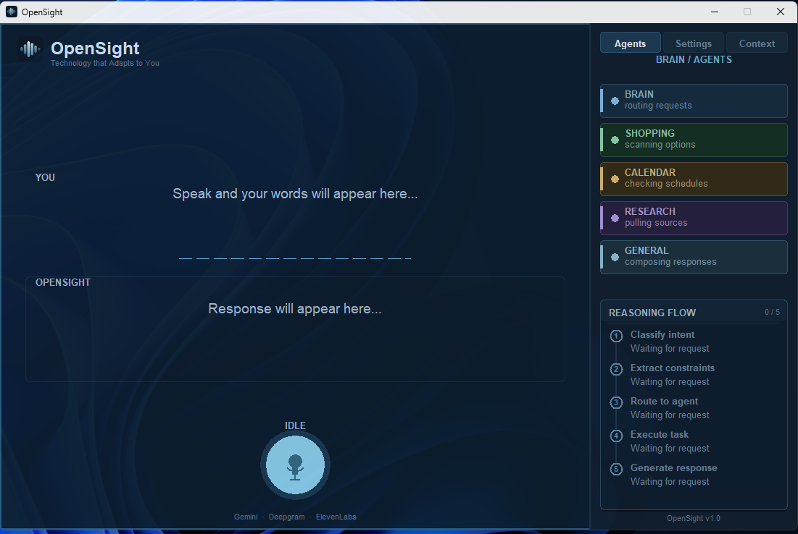

# OpenSight

**Technology that Adapts to You.**

> An AI-powered voice assistant that replaces screen readers with active, intent-driven task execution: navigating, searching, and acting on behalf of visually impaired users.

*Google Developer Groups on Campus Solution Challenge 2026 · Sustainable Development Goal 10 · Sustainable Development Goal 3*

---

## Demo

> **[▶ Watch the 2-minute demo](https://youtu.be/UOYZ2oXvdvM)**

Three spoken sentences take the user from a research question to a chosen product. Cross-agent memory carries context across tasks, with zero manual navigation. The full step-by-step demo script lives in [DEMO.md](DEMO.md).

---

## The Problem

**2.2 billion people** worldwide have a vision impairment (WHO, 2023), of whom 39 million are blind. The tools built to help them have not fundamentally changed in decades.

Screen readers process interfaces **linearly**, reading every element from top to bottom. The result:

- Blind web users lose an average of **30.4% of their time** to frustrating screen reader situations including confusing layout feedback, conflicts with applications, and missing alt text *(Lazar et al., International Journal of Human-Computer Interaction)*
- **97% of the web remains inaccessible** to the disabled community *(AudioEye, 2024, scan of ~40,000 enterprise websites)*
- Blind users attempting Fortune 500 job applications succeeded only **55.6% of the time**. The shortest application took 20 minutes, the longest took **135 minutes** *(Journal of Visual Impairment & Blindness, 2023)*

This is not a niche problem. It is a systemic exclusion from the modern web.

---

## The Results

OpenSight completes the same product research and selection task **5x faster than the average screen reader user, and up to 10x faster for a first-time user**, reducing a 5-10 minute task to under 60 seconds.

| User type | NVDA baseline | OpenSight | Speedup |
|---|---|---|---|
| Beginner (self-measured, first NVDA use) | ~10 min | ~60 sec | **~10x** |
| Average *(Lazar et al., published literature)* | ~5 min | ~60 sec | **~5x** |
| Expert *(published literature)* | ~2 min | ~60 sec | **~2x** |

The beginner baseline was measured directly: with no prior NVDA experience, completing the same omega-3 supplement search task on Amazon took approximately 10 minutes. OpenSight completed the identical task in under 60 seconds. This is an **80-90% reduction in interaction time**. The gain is not speed of speech. It is the elimination of navigation overhead entirely.

---

## The Solution

OpenSight replaces passive reading with **active task execution**.

Users speak naturally. OpenSight understands intent, navigates autonomously, and speaks results back without the user ever touching a keyboard or memorizing a shortcut.

**Stanford University** found speech input is **3x faster than keyboard** (161 vs 53 WPM) with a 20.4% lower error rate. OpenSight is built on that insight end-to-end.

### What makes it different

Existing tools like NVDA and JAWS read interfaces linearly and have no awareness of context between tasks. Apple VoiceOver is mobile-first and does not navigate desktop web flows autonomously. Even ChatGPT and general voice assistants cannot open a browser, navigate search results, and carry context from one query into the next without being told every step explicitly.

OpenSight does all of this with a single spoken sentence per step.

**Cross-agent memory:** After a research query, OpenSight automatically carries that context into a follow-up shopping search. The user says *"find me a supplement for that"* and OpenSight already knows what "that" is. No existing screen reader or voice assistant does this.

**Live page awareness:** When a product page opens, OpenSight scrapes it in real time. Asking *"what are the ingredients"* returns the actual ingredient list from the open page, not a generic web search.

**Wake word activation:** Say *"OpenSight"* from anywhere and the app comes to the foreground, ready to listen. Browser windows step aside automatically. OpenSight reclaims focus when you speak to it.

---

## Interface



---

## Architecture

```
User speaks
    |
    v
Deepgram Nova-2 STT -- real-time streaming speech to text
    |
    v
Firebase Authentication -- per-user identity; the client carries a user token, never a model key
    |
    v
OpenSight server on Google Cloud -- FastAPI WebSocket · SessionMemory · browser_manager
    -- holds the Vertex AI service account; every model call happens server-side
    |
    v
Gemini 2.5 Flash on Vertex AI -- intent classification · preference extraction
    |
    |--► Shopping agent --► Playwright → Amazon (scrapes results + product pages)
    |
    |--► Research agent --► SerpAPI → Google Scholar (extracts product_hint for handoff)
    |
    |--► Calendar agent --► Google Calendar API (read + create events)
    |
    └--► General agent --► Google Custom Search API + Gemini synthesis
    |
    v
Google Cloud Text-to-Speech -- spoken response streamed back to user
```

### How it works

**Secure, keyless clients:** No client holds a model key. The desktop app and the Android client authenticate the user with Firebase Authentication and talk only to the OpenSight backend. The backend, on Google Cloud, holds the Vertex AI credentials as a server-side service account and makes every Gemini call itself. This replaces the original single-embedded-key model: the credential never leaves the server, and Firebase Authentication controls who can use the backend.

**Production model serving:** Gemini 2.5 Flash runs on Vertex AI, Google's production AI platform, giving production-grade quota and scaling rather than a rate-limited developer key.

**Routing:** Every utterance passes through Gemini 2.5 Flash which classifies intent and decides which agent handles it. Follow-up queries are detected and short-circuited before Gemini using local pattern matching, preserving context without extra API calls.

**Cross-agent handoff:** `SessionMemory` persists across all agents and WebSocket reconnects. When the Research agent finds papers on omega-3, it extracts a `product_hint` and stores it. When the user says *"find me a supplement for that under $30"*, the router detects the research context and builds the Amazon query automatically.

**Browser lifecycle:** All browser windows are managed through a central `browser_manager` registry. Opening Amazon closes Scholar. Opening a product page closes Amazon. When the wake word fires, `browser_manager.focus_opensight()` snaps the desktop app back to the foreground via Win32 `SetForegroundWindow`.

**Live scraping:** When a product page opens, Playwright scrapes ingredient fields and feature bullets before handing control to the user. Follow-up questions about the open product are answered from scraped data, not a web search.

---

## Validation

OpenSight is validated on two tracks: structured task testing, and direct partnership with the organizations and leaders who serve the blind and visually impaired (BVI) community.

### Task testing

Tested using simulated visual impairment methodology, a standard technique in HCI accessibility research where participants complete tasks without visual input to approximate the screen reader experience.

**Self-measured baseline:** With no prior NVDA experience, the omega-3 supplement search task on Amazon took approximately 10 minutes. The identical task took under 60 seconds with OpenSight.

**Structured user testing (20 participants):**

- Average speed improvement rating: **7.9 / 10**
- Average navigation replacement rating: **7.8 / 10**
- Task completion rate: **20 / 20 participants completed the full four-step demo task without assistance**
- 80% said they would use a voice-first interface daily or for specific tasks

Three consistent feedback themes emerged: accent recognition accuracy (raised by 4 participants), response latency on complex queries (raised by 3 participants), and clearer audio cues for when to speak (raised by 2 participants). All three are on the active roadmap.

### Partnership and stakeholder validation

We are working directly with organizations and leaders in the BVI space to validate the problem, shape the product around real user needs, and run structured trials with BVI participants.

**Virginia Department for the Blind and Vision Impaired (DBVI):** We are working with the Regional Manager and the Director of Rehabilitation Technology Services to ground OpenSight in the real workflows and needs of the people the agency serves. Their feedback directly informed planned low-vision support such as font scaling.

**Blind Institute of Technology (BIT):** We are working with **Mike Hess, Founder and Executive Director**. Mike is a blind, 20-year IT industry veteran who founded BIT to place BVI professionals in Fortune 500 companies nationwide. BIT's accessibility work has been recognized with national awards and featured at **Google Cloud Next 2019** and Dreamforce 2019.

Structured trials with blind and visually impaired participants are being conducted through these partnerships as the next validation phase, moving beyond simulated testing to direct feedback from the community OpenSight is built for.

**Clean install verified:** The full setup from a fresh build has been tested and confirmed working.

---

## Scalability & Future Vision

### Built to scale

OpenSight is built around decisions that make it inherently extensible and ready for real users.

**Multi-agent architecture:** Adding a new capability (email, file management, IDE control, music) is just adding a new agent file and a routing rule in `router.py`. The voice pipeline, memory system, and WebSocket server are fully decoupled from what agents do. The system currently has five agents. It could have fifty without touching the core.

**Cloud-hosted and keyless clients:** The FastAPI backend is hosted on Google Cloud and holds the Vertex AI credentials server-side. Clients carry no model key: they authenticate the user with Firebase Authentication and call the backend, which makes the model calls. This is a true multi-user foundation, with no shared embedded key and each user identified and gated individually.

**Zero-friction distribution by design:** OpenSight ships as a standalone Windows executable. The end user downloads one `.exe`, double-clicks it, and says "OpenSight": no Python, no dependencies, no terminal, no API keys. This was an intentional scalability decision, not a convenience afterthought. The target user is a blind or visually impaired person, not a developer, so the distributed artifact has to behave like any ordinary consumer app. Everything heavy or sensitive (agent orchestration, model access, credentials) lives in the Google Cloud backend, and the client stays thin. Onboarding a new user is a single download with no per-user keys to provision and nothing to configure, so reaching more users is a distribution problem, not a setup problem. The executable is the distribution endpoint of a system architected from the start to scale.

**Cross-platform reach (proof of concept):** A Flutter-based **Android client** has been built as a completed proof of concept. It is a thin, accessible, voice-first front door to the same Google Cloud backend, designed to be fully usable eyes-free with Android TalkBack. It was built phone-first on purpose: blind and visually impaired users rely overwhelmingly on phones with built-in screen readers, so the phone is the real distribution surface. iOS was intentionally excluded from this phase. The platform's permission model places inherent constraints on the always-listening microphone access and cross-application control that are central to OpenSight's design, whereas Android's more open model fits a voice-first, always-available assistant.

The always-on wake word loop means OpenSight already functions as a background accessibility layer, the foundation for full OS-level control across any application.

### Near-term roadmap

- Full OS-level control: IDE navigation, file management, email
- Cross-application memory: preferences and context that survive across sessions
- Low-vision support: font scaling and screen magnification alongside the voice-first flow
- Harden the Android proof of concept into a full release on the same agent backend
- Braille display output: parallel text channel alongside voice
- Expanded structured trials with BVI participants through our DBVI and BIT partnerships

---

## Google Developer Groups on Campus: Google Technologies Used

| Technology | How OpenSight uses it |
|---|---|
| **Gemini 2.5 Flash** | Intent routing on every utterance, response synthesis, preference extraction, cross-agent reasoning, follow-up detection |
| **Vertex AI** | Production serving for Gemini 2.5 Flash, called server-side via a service account: production-grade quota, control, and scaling |
| **Firebase Authentication** | Per-user identity, replacing the single-embedded-key model and gating who can use the backend |
| **Google Cloud Text-to-Speech** | Spoken responses streamed back to the user |
| **Google Cloud** | Hosting for the FastAPI backend, which holds all model credentials |
| **Google Custom Search API** | Powers the General agent for web search on any query that does not require Amazon, Scholar, or Calendar |
| **Google Calendar API** | The Calendar agent reads and creates events via OAuth |
| **Google Scholar** (via SerpAPI) | Academic paper search for the Research agent, with automatic product keyword extraction for cross-agent handoff |

---

## Sustainable Development Goals Addressed

### SDG 10: Reduced Inequalities *(primary)*

OpenSight directly targets the digital accessibility gap. Visually impaired users are systematically excluded from the efficiency gains of modern web interfaces including e-commerce, research tools, and scheduling platforms. By replacing linear screen reading with intent-driven navigation, OpenSight reduces the time and cognitive load gap between sighted and visually impaired users.

97% of the web is inaccessible. OpenSight does not wait for the web to fix itself. It navigates it as-is, on behalf of the user.

**Measurable outcome:** OpenSight completes a product research and selection task in under 60 seconds. That is 5x faster than the average screen reader user baseline and 10x faster than a beginner baseline, both measured under controlled conditions.

### SDG 3: Good Health and Well-Being *(secondary)*

Independence is directly correlated with mental health outcomes for people with disabilities. Tools that reduce reliance on sighted assistance and eliminate the documented frustration of inaccessible interfaces contribute to autonomy, confidence, and well-being. OpenSight requires zero prior technical training and zero memorized keyboard shortcuts.

---

## Tech Stack

| Layer | Technology |
|---|---|
| Voice input | Deepgram Nova-2 real-time STT |
| LLM | Gemini 2.5 Flash on Vertex AI (called server-side via a service account) |
| Authentication | Firebase Authentication (per-user) |
| Agent orchestration | Python (custom multi-agent loop) |
| Browser automation | Playwright (Chromium) |
| Voice output | Google Cloud Text-to-Speech |
| Backend | FastAPI + WebSockets, hosted on Google Cloud |
| Desktop client | Tkinter (custom LiquidGlass renderer), packaged as a standalone Windows .exe |
| Mobile client | Android (Flutter), completed proof of concept; iOS excluded by design (platform permission constraints) |
| Memory | JSON persistence + in-memory SessionMemory |
| Window management | Win32 ctypes (SetForegroundWindow) |

---

## Get OpenSight

- **End users:** download the standalone Windows executable, run it, and say **"OpenSight."** No Python, no dependencies, no API keys.
- **Developers:** see **[SETUP.md](SETUP.md)** to install, configure Google Cloud and Firebase, and run from source.
- **Demo:** see **[DEMO.md](DEMO.md)** for the four-step demo script and reset flow.

---

## Team

Built for the **Google Developer Groups on Campus Solution Challenge 2026**

*Virginia Tech*