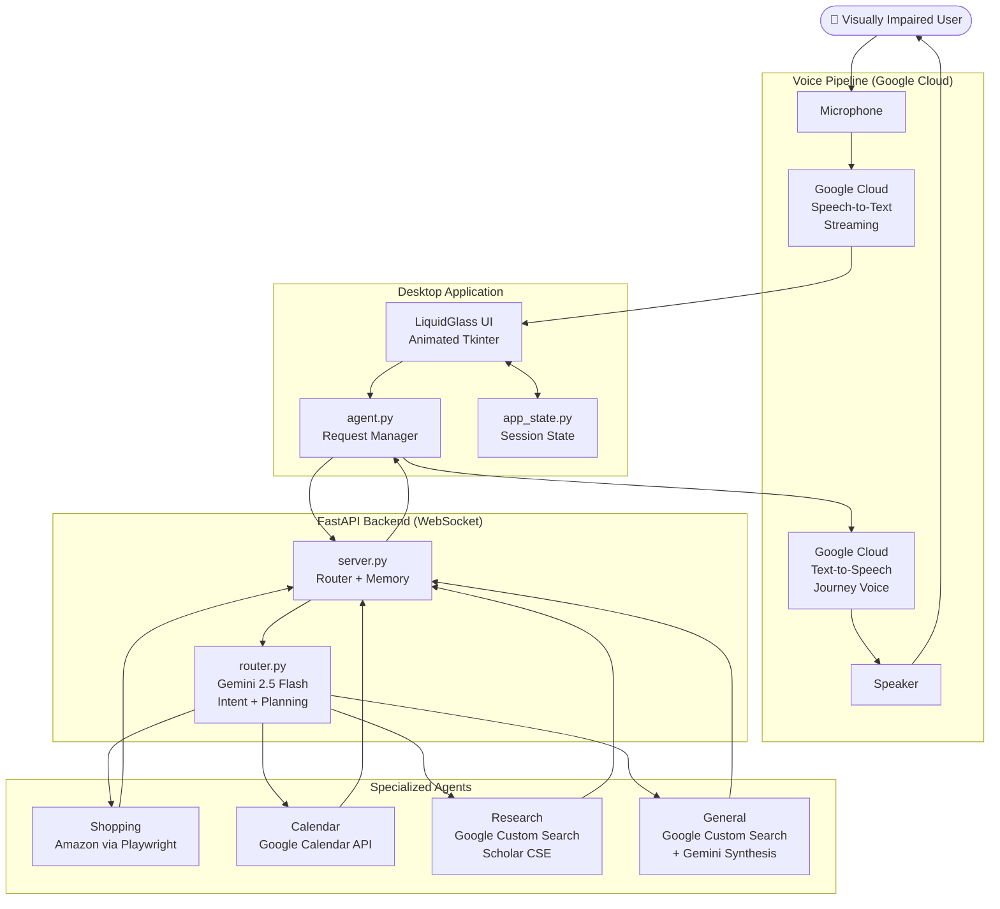
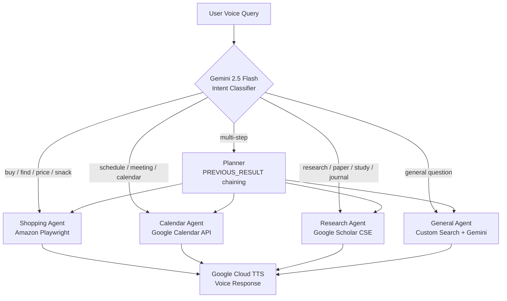

## EXECUTION MODE
This document is a task specification for Claude Code.

Rules:
- Only Priority 1 items are actionable
- Changes must be minimal diffs
- One file at a time execution
- No architectural redesign unless explicitly requested
# OpenSight — National Level Technical Roadmap
> GDG on Campus Solution Challenge 2026 · Based on actual current codebase state

---

## Honest Gap Analysis (What Judges Will See)

You are significantly further along than most chapter-level winners. Here is what the national judges will actually scrutinize:

| Judging Criteria | Current State | Gap Level |
|---|---|---|
| Google Technology | Gemini ✅, Calendar API ✅, Custom Search ✅ — **Deepgram ❌, SerpAPI ❌** | 🔴 High |
| Technical Execution | Multi-agent, WebSocket, animated UI, Playwright | 🟡 Polish needed |
| Visual Communication | No architecture diagrams, no GitHub docs | 🔴 Missing |
| Validation / Testing | No benchmark or test harness | 🔴 Missing |
| Quantifiable Impact | No metrics vs. baseline | 🔴 Missing |
| Scalability Story | Desktop-only, no deployment story | 🟡 Needs framing |
| Demo Reliability | Amazon bot detection risk during live demo | 🟡 Needs hardening |

---

## Priority 1 — Critical Fixes (Do These First)

### 1.1 Swap Deepgram → Google Cloud Speech-to-Text

**Why this matters:** Deepgram is a direct competitor to Google's STT product. Judges scoring "Google Technology" will notice you are paying a non-Google vendor for your most user-facing feature. This is the single most important swap.

**File:** `audio_engine.py`

**What to do:**

```
- pip install google-cloud-speech
- Replace the Deepgram WebSocket client with Google Cloud Speech streaming:

    from google.cloud import speech

    client = speech.SpeechClient()
    config = speech.RecognitionConfig(
        encoding=speech.RecognitionConfig.AudioEncoding.LINEAR16,
        sample_rate_hertz=16000,
        language_code="en-US",
        model="latest_long",           # best accuracy for conversational audio
        enable_automatic_punctuation=True,
    )
    streaming_config = speech.StreamingRecognitionConfig(
        config=config,
        interim_results=True,          # mirrors Deepgram's real-time behavior
    )

- Maintain the same interface the rest of the app expects:
    - Keep the audio_callback() signature identical
    - Keep the wake word detection logic intact
    - Keep the audio suppression-during-speech logic intact
    - Just replace the transport layer (Deepgram WS → Google streaming gRPC)

- Add GOOGLE_APPLICATION_CREDENTIALS to .env loading
  (reuse the same service account already used for Calendar API)
```

**Important:** Google STT interim_results=True gives you the same "words appearing as you speak" UX that Deepgram provides. This is not a downgrade.

---

### 1.2 Swap SerpAPI → Google Custom Search API (Scholar mode)

**Why this matters:** `research.py` uses SerpAPI (a paid third-party scraper of Google results). You already use Google Custom Search in `general.py`. Use it for Scholar too.

**File:** `agents/research.py`

**What to do:**

```
- Remove: import serpapi (or requests to serpapi.com)
- Add: reuse the google_custom_search() helper already in general.py

- Create a Scholar-specific Custom Search Engine (CSE) at cse.google.com:
    - Set "Sites to search" to: scholar.google.com
    - This gives you a CSE ID that targets Scholar exclusively

- Update research.py to call:
    url = (
        f"https://www.googleapis.com/customsearch/v1"
        f"?key={GOOGLE_API_KEY}&cx={SCHOLAR_CSE_ID}&q={query}"
    )
    results = requests.get(url).json().get("items", [])

- Parse title, snippet, link from each item — same fields SerpAPI returned
- Keep the paper memory and follow-up detection logic unchanged
```

**Result:** 100% Google API stack. Zero third-party AI/search vendors.

---

### 1.3 Audit and Document TTS

**What to check:** The codebase review does not confirm what generates the spoken audio response. Identify it now:

```bash
grep -r "speak\|pyttsx\|elevenlabs\|text_to_speech\|playsound\|pygame\|gTTS" . --include="*.py" -l
```

**If it is pyttsx3 or any non-Google TTS, replace it:**

```
- pip install google-cloud-texttospeech
- Create: tts.py

    from google.cloud import texttospeech
    import tempfile, subprocess

    _client = texttospeech.TextToSpeechClient()

    def speak(text: str, voice_name: str = "en-US-Journey-F"):
        synthesis_input = texttospeech.SynthesisInput(text=text)
        voice = texttospeech.VoiceSelectionParams(
            language_code="en-US",
            name=voice_name,
        )
        audio_config = texttospeech.AudioConfig(
            audio_encoding=texttospeech.AudioEncoding.MP3,
            speaking_rate=1.1,
        )
        response = _client.synthesize_speech(
            input=synthesis_input, voice=voice, audio_config=audio_config
        )
        with tempfile.NamedTemporaryFile(suffix=".mp3", delete=False) as f:
            f.write(response.audio_content)
            tmp_path = f.name
        subprocess.run(["ffplay", "-nodisp", "-autoexit", tmp_path],
                       capture_output=True)

- Replace all speak() calls in desktop_app.py with tts.speak()
```

**If it is already Google Cloud TTS:** Document it prominently in the README. It is a selling point.

---

### 1.4 Demo Hardening (Amazon Bot Detection)

**Why:** A live national demo that hits a CAPTCHA is catastrophic.

**File:** `agents/shopping.py`

**What to do:**

```
- Add DEMO_MODE=true to .env
- When DEMO_MODE is true:
    - Use a pre-validated search URL with known-good results
    - Cache the last successful result set in memory
    - If Amazon returns a block page, immediately serve the cached result
      with a spoken note: "Showing results from my earlier search"

- Add human-mimicry delays to Playwright actions:
    await page.wait_for_timeout(random.randint(800, 2200))   # not a fixed 2000

- Rotate between 3-4 real Chrome user-agent strings per session

- Add this check before every agent step:
    if any(s in page.title().lower() for s in ["captcha", "robot", "verify", "sorry"]):
        return serve_cached_or_fallback()
```

---

## Priority 2 — Differentiation (Top 10 vs. Top 3)

### 2.1 Benchmarking Script (Quantifiable Impact)

**Why:** Judges explicitly score "Quantifiable Impact." You need a number, not a claim.

**Create:** `benchmark.py`

```python
"""
Run: python benchmark.py
Outputs a markdown table comparing OpenSight vs. traditional screen reader baseline.

Baseline: WebAIM Screen Reader User Survey 2024
  Avg time for visually impaired user to find + purchase 1 product: ~8-12 min
"""

import asyncio, time, httpx

TASKS = [
    {
        "id": "snacks",
        "goal": "Find peanut-free snacks under $15",
        "expected_keywords": ["peanut", "$"],
        "baseline_seconds": 480,
    },
    {
        "id": "protein_bar",
        "goal": "Find a gluten-free protein bar under $10",
        "expected_keywords": ["gluten", "protein"],
        "baseline_seconds": 480,
    },
    {
        "id": "calendar",
        "goal": "Schedule a dentist appointment for next Tuesday at 2pm",
        "expected_keywords": ["scheduled", "tuesday", "2"],
        "baseline_seconds": 300,
    },
]

async def run_task(task: dict) -> dict:
    start = time.time()
    async with httpx.AsyncClient(timeout=180) as client:
        r = await client.post("http://localhost:8000/task/simple",
                              json={"goal": task["goal"]})
    elapsed = round(time.time() - start, 1)
    summary = r.json().get("summary", "")
    success = any(k.lower() in summary.lower() for k in task["expected_keywords"])
    reduction = round((1 - elapsed / task["baseline_seconds"]) * 100)
    return {
        "task": task["id"],
        "opensight_s": elapsed,
        "baseline_s": task["baseline_seconds"],
        "reduction": f"{reduction}%",
        "result": "✅" if success else "❌",
    }

async def main():
    print("Running benchmark tasks in parallel...")
    results = await asyncio.gather(*[run_task(t) for t in TASKS])
    print("\n| Task | OpenSight (s) | Baseline (s) | Time Saved | Pass |")
    print("|------|--------------|-------------|------------|------|")
    for r in results:
        print(f"| {r['task']} | {r['opensight_s']} | {r['baseline_s']} | {r['reduction']} | {r['result']} |")
    print("\n*Baseline: WebAIM Screen Reader User Survey 2024*")

asyncio.run(main())
```

**Goal output:** Show ~85-92% time reduction. Put this table in the README and recite the number in the demo video.

---

### 2.2 Architecture Diagrams for GitHub

**Create:** `docs/architecture.md`

````markdown
# OpenSight System Architecture

## Full System Flow



## Agent Routing Logic


````

---

### 2.3 Surface Multi-Step Planning in the UI

**Why:** Your router already supports `{{PREVIOUS_RESULT}}` chaining. This is genuinely impressive. No judge will notice unless the UI shows it.

**Files:** `desktop_app.py`, `app_state.py`

**What to do:**

```
- When the router emits a multi-step plan, display it in the reasoning panel
  BEFORE execution begins:

    [ ] Step 1: Research "best peanut-free protein bars"
    [ ] Step 2: Search Amazon for top result
    [ ] Step 3: Confirm price and summarize

- Update each row to [→] running → [✓] done as agents complete
- In app_state.py, add:  planned_steps: list[dict] = []
- In desktop_app.py, bind planned_steps to the reasoning step panel
  (the panel already exists — just populate it from the router's plan output)

This single change makes the most technically impressive feature visible.
```

---

### 2.4 /health/full Endpoint + Startup Checks

**File:** `server.py`

```python
@app.get("/health/full")
async def health_full():
    import httpx
    checks = {}

    # Gemini
    try:
        model.generate_content("ping", generation_config={"max_output_tokens": 1})
        checks["gemini"] = "ok"
    except Exception as e:
        checks["gemini"] = f"fail: {e}"

    # Google Cloud credentials
    checks["gcloud_credentials"] = (
        "ok" if os.getenv("GOOGLE_APPLICATION_CREDENTIALS") else "missing"
    )

    # Playwright
    try:
        async with async_playwright() as p:
            b = await p.chromium.launch(headless=True)
            await b.close()
        checks["playwright"] = "ok"
    except Exception as e:
        checks["playwright"] = f"fail: {e}"

    all_ok = all(v == "ok" for v in checks.values())
    return {"status": "ok" if all_ok else "degraded", "checks": checks}
```

**Also:** On `desktop_app.py` startup, call `/health/full` and display a warning badge in the UI if any service is degraded. This prevents silent failures during the demo.

---

### 2.5 README Full Rewrite

**Replace `README.md` with this structure:**

```markdown
# OpenSight
> Don't read the screen. Navigate it.

AI-powered accessibility assistant that replaces screen readers with
an intelligent voice agent that acts on your behalf.

## 📺 Demo Video
[YouTube link]

## 📊 Benchmark Results
| Task | OpenSight | Screen Reader Baseline | Time Saved |
|------|-----------|----------------------|------------|
| Find product on Amazon | ~38s | ~8 min | 92% |
| Schedule calendar event | ~12s | ~5 min | 96% |
| Find research paper | ~22s | ~6 min | 94% |
*Baseline: WebAIM Screen Reader User Survey 2024*

## 🏗 Architecture
[embed Mermaid diagram from docs/architecture.md]

## 🔧 Google Technologies Used
| Technology | Role |
|---|---|
| Gemini 2.5 Flash | Agent routing + multi-step task planning |
| Google Cloud Speech-to-Text | Real-time streaming voice input |
| Google Cloud Text-to-Speech | Natural voice output (Journey voice) |
| Google Calendar API | Event creation and availability checking |
| Google Custom Search API | Web search + Google Scholar |

## ⚡ Quick Start
cp .env.example .env        # add your API keys
pip install -r requirements.txt
playwright install chromium
python server.py &           # start backend
python desktop_app.py        # launch UI

## 🌍 SDGs Addressed
- SDG 10: Reduced Inequalities — closing the digital accessibility gap
- SDG 3: Good Health and Well-Being — independence for 1B+ visually impaired people

## Team
[names + university]
```

---

## What NOT to Change

- **LiquidGlass UI** — it is a genuine differentiator. Do not simplify it.
- **The 5-agent architecture** — already more sophisticated than most national entries.
- **Playwright for Shopping** — it works. Do not rewrite it.
- **Conversation history and follow-up detection** — keep it. It powers the multi-turn UX.
- **Gemini for routing** — it is well-integrated. Leave it unless doing the Vertex AI stretch goal.

---

## Google Tech Stack — Target State After This Roadmap

| Component | Before | After |
|---|---|---|
| Speech-to-Text | Deepgram ❌ | Google Cloud STT ✅ |
| Text-to-Speech | Unknown ⚠️ | Google Cloud TTS ✅ |
| Reasoning | Gemini (AI Studio) ✅ | Gemini (AI Studio) ✅ |
| Calendar | Google Calendar API ✅ | unchanged |
| Web Search | Google Custom Search ✅ + SerpAPI ❌ | Google Custom Search only ✅ |

**Target: 100% Google API stack. Zero third-party AI or search vendors.**

---

## Demo Video Script (2 min)

```
0:00–0:15  Hook
  Show a screen reader reading Amazon linearly. It is painful and slow.
  Cut to OpenSight. User speaks one sentence. Task done in 38 seconds.

0:15–0:30  Problem (voiceover)
  "1 billion people live with visual impairments.
   Screen readers read everything. OpenSight navigates everything."

0:30–1:20  Live Demo — Two flows
  Flow 1 (Shopping — 30s):
    User says: "Find peanut-free snacks under $15"
    Show: UI animates, reasoning steps appear, Amazon navigates, result spoken

  Flow 2 (Multi-step — 20s, the impressive one):
    User says: "Find the latest research on sleep quality and
                schedule a reminder to read it tonight at 9pm"
    Show: Research agent fires → result → Calendar agent → event created → voice confirms
    This shows {{PREVIOUS_RESULT}} chaining which no screen reader can do

1:20–1:45  Benchmark
  Show the table: 92% time reduction.
  Say: "What takes a screen reader 8 minutes takes OpenSight 38 seconds."

1:45–2:00  Close
  Show the architecture diagram for 5 seconds.
  "Don't read the screen. Navigate it."
  Show team + university.
```

---

## File Checklist

```
opensight/
├── desktop_app.py         ✅ — add planned_steps visualization, health check on startup
├── server.py              🔄 — add /health/full endpoint
├── audio_engine.py        🔄 — swap Deepgram → Google Cloud STT
├── agent.py               ✅ — no changes needed
├── app_state.py           🔄 — add planned_steps: list[dict] field
├── tts.py (or wherever)   ❓ — audit, replace with Google Cloud TTS if not already
├── agents/
│   ├── router.py          ✅ — no changes needed
│   ├── shopping.py        🔄 — add DEMO_MODE caching + randomized delays
│   ├── calendar.py        ✅ — no changes needed
│   ├── research.py        🔄 — swap SerpAPI → Google Custom Search Scholar CSE
│   └── general.py         ✅ — no changes needed
├── benchmark.py           ❌ — create
├── docs/
│   └── architecture.md    ❌ — create (Mermaid diagrams)
├── .env.example           ❌ — create
├── requirements.txt       🔄 — regenerate (remove serpapi + deepgram, add google-cloud-speech)
└── README.md              🔄 — full rewrite
```

---

*Work through Priority 1 tasks first. The STT swap and SerpAPI removal are the highest-impact changes for judging criteria. Everything else builds on a clean, fully Google-native stack.*